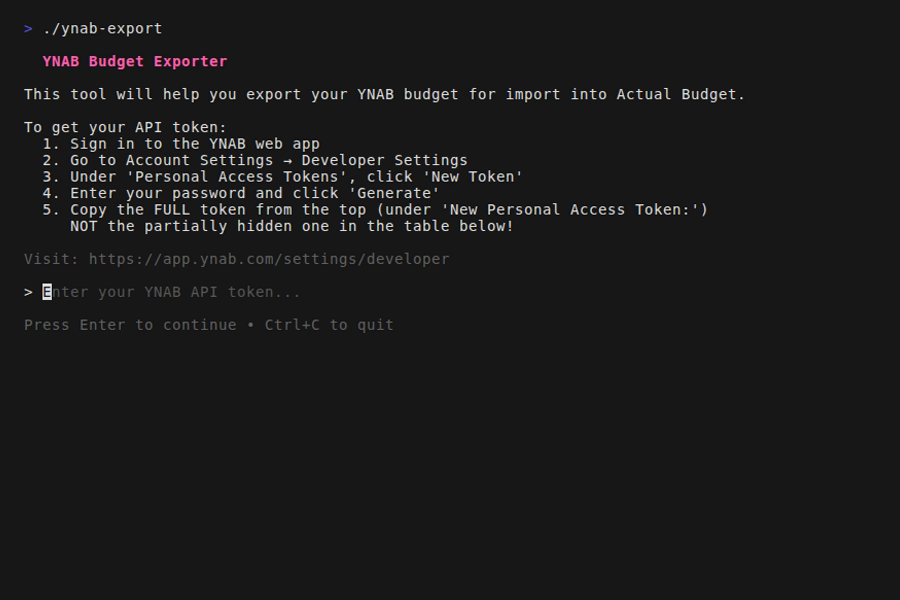
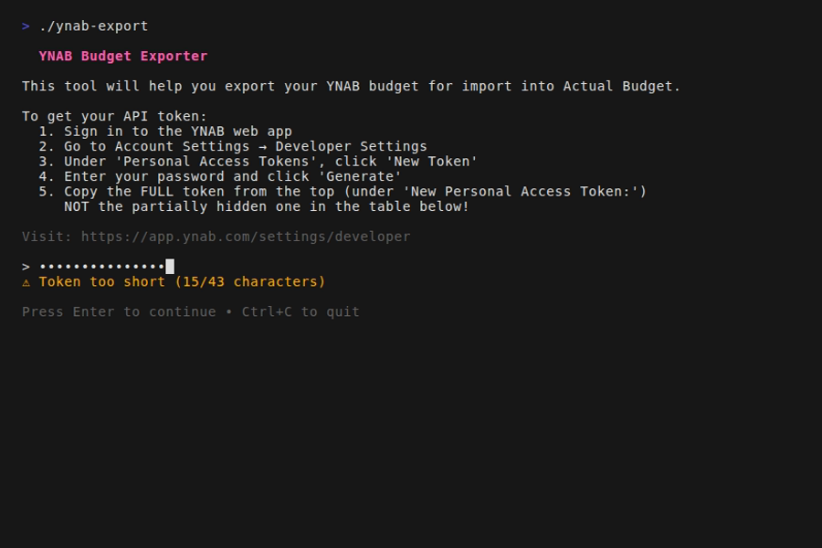
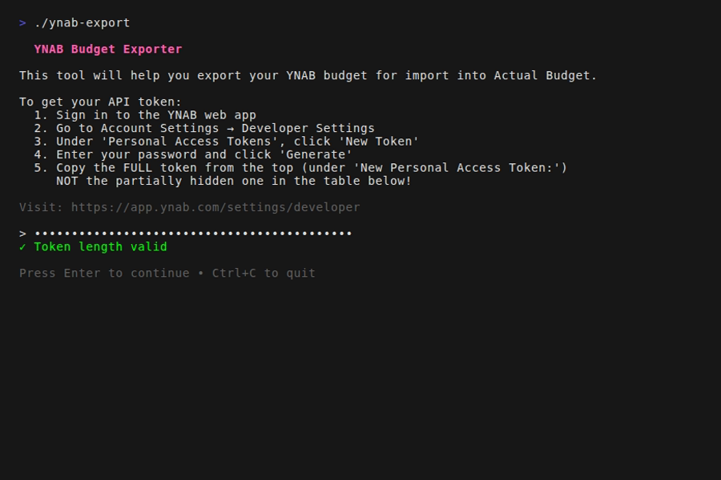
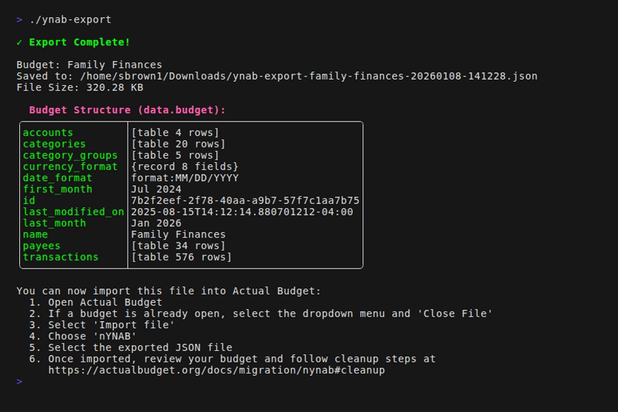

# YNAB Export Tool

A simple, beginner-friendly tool to export your YNAB (You Need A Budget)
budget data for import into [Actual Budget][actual-budget].

This tool simplifies the export process described in the
[Actual Budget migration guide][actual-migration] by providing an
interactive terminal interface that guides you through each step.

## Quick Start

1. **[Download](#installation)** the binary for your platform
2. **[Get your YNAB API token](#step-1-get-your-ynab-api-token)** from Developer Settings
3. **[Run the tool](#step-2-run-the-tool)** from your terminal
4. **[Follow the prompts](#step-3-follow-the-prompts)** to select and export your budget
5. **[Import into Actual Budget](#step-4-import-into-actual-budget)** using the exported file

🔒 Secure • 🚀 Fast • 🌐 Cross-platform • 📦 No installation required

## Demo


---

## Installation

### Download Pre-built Binary

Download the latest release for your operating system from the [Releases page][releases].

Choose the appropriate binary:

- **Windows**: `ynab-export_*_windows_amd64.exe`
- **macOS (Intel)**: `ynab-export_*_darwin_amd64`
- **macOS (Apple Silicon)**: `ynab-export_*_darwin_arm64`
- **Linux (64-bit)**: `ynab-export_*_linux_amd64`
- **Linux (ARM64)**: `ynab-export_*_linux_arm64`

The binaries are ready to run - no extraction or installation needed!

**Download via terminal:**

```bash
# Linux (64-bit)
curl -L -o ynab-export https://github.com/StephenBrown2/ynab-export/releases/latest/download/ynab-export_linux_amd64
chmod +x ynab-export

# Linux (ARM64)
curl -L -o ynab-export https://github.com/StephenBrown2/ynab-export/releases/latest/download/ynab-export_linux_arm64
chmod +x ynab-export

# macOS (Apple Silicon)
curl -L -o ynab-export https://github.com/StephenBrown2/ynab-export/releases/latest/download/ynab-export_darwin_arm64
chmod +x ynab-export

# macOS (Intel)
curl -L -o ynab-export https://github.com/StephenBrown2/ynab-export/releases/latest/download/ynab-export_darwin_amd64
chmod +x ynab-export
```

**Windows (PowerShell):**

```powershell
Invoke-WebRequest -Uri https://github.com/StephenBrown2/ynab-export/releases/latest/download/ynab-export_windows_amd64.exe -OutFile ynab-export.exe
```

<details>
<summary><b>Advanced: Build from Source</b></summary>

### Build from Source

If you have Go installed (version 1.25 or later), you can build from source:

> **Note:** This project uses Go's experimental `encoding/json/v2` package.
> You'll need to set the `GOEXPERIMENT` environment variable.

```bash
GOEXPERIMENT=jsonv2 go install github.com/StephenBrown2/ynab-export@latest
```

Or clone and build:

```bash
git clone https://github.com/StephenBrown2/ynab-export.git
cd ynab-export
GOEXPERIMENT=jsonv2 go build
```

### Using Just (Build Tool)

If you have [Just][just] installed:

```bash
# Build for current platform
just build

# Build for all platforms
just build-all

# Run directly
just run

# See all available commands
just
```

</details>

## Usage

### Step 1: Get Your YNAB API Token

Before running the tool, you'll need a YNAB Personal Access Token:

1. Sign in to the [YNAB web app][ynab-app]
2. Go to **Account Settings** → **Developer Settings**
3. Under "Personal Access Tokens", click **New Token**
4. Enter your password and click **Generate**
5. **Important**: Copy the FULL token from the top of the page (under "New Personal Access Token:")
   - Do NOT use the partially obfuscated token shown in the table (e.g., `XXXXXXXXXX-Wax0q8`)
   - The token is only shown once, so copy it immediately!

Direct link: [YNAB Developer Settings][ynab-developer]

### Step 2: Run the Tool

Simply run the downloaded binary:

**Linux/macOS:**

```bash
# Make it executable (if not already)
chmod +x ynab-export

# Run it
./ynab-export

# Or provide your token directly
./ynab-export --token "your-api-token-here"
```

**Windows:**

Run from Command Prompt, PowerShell, or Windows Terminal:

```cmd
ynab-export.exe

REM Or provide your token directly
ynab-export.exe --token "your-api-token-here"
```

> **Note:** Do not double-click the `.exe` file - it must be run from
> a terminal to interact with the application properly.
>
> **Recommended:** Install [Windows Terminal][windows-terminal] for the
> best experience. It's free from the Microsoft Store and provides a
> modern terminal with better colors and font rendering.
> To install: Open Microsoft Store → Search "Windows Terminal" → Click "Get".
> Once installed, right-click in your Downloads folder and select
> "Open in Terminal" to run the executable.
>
> **Tip:** If you downloaded from the browser, you can rename the binary to simply
> `ynab-export` (or `ynab-export.exe` on Windows) for easier use.

### Step 3: Follow the Prompts

The tool will guide you through:

1. **Enter your API token** (the token you generated in Step 1)
   - The tool validates the token length (43 characters) as you type
   - **Your token is automatically saved** for future use
   - On subsequent runs, the tool will use your cached token
2. **Select your budget** from the list of budgets in your YNAB account
3. **Wait for export** - the tool downloads your budget data
4. **Done!** Your budget is saved to `~/Downloads/ynab-export-budget-name-YYYYMMDD-HHMMSS.json`

<details>
<summary><b>Token Priority Order</b></summary>

The tool looks for your token in this order:

1. **Command-line flag** (`-t` or `--token`)
2. **Environment variable** (`YNAB_API_TOKEN`)
3. **Cached token** (stored in `~/.cache/ynab-export/ynab-api-token` on Linux/macOS)
4. **Manual entry** (prompted in the app)

If a cached token becomes invalid (e.g., revoked on YNAB), it will be automatically deleted.

</details>

<details>
<summary><b>Advanced: Using Environment Variable for Token</b></summary>

To skip entering your token each time, set the `YNAB_API_TOKEN` environment variable:

```bash
# Linux/macOS
export YNAB_API_TOKEN="your-token-here"
./ynab-export

# Windows (PowerShell)
$env:YNAB_API_TOKEN="your-token-here"
.\ynab-export.exe

# Windows (Command Prompt)
set YNAB_API_TOKEN=your-token-here
ynab-export.exe
```

The tool will automatically validate the token from the environment variable and skip the token entry screen if valid.

</details>

### Step 4: Import into Actual Budget

Now that you have your exported JSON file:

1. Open **Actual Budget**
2. Select the dropdown menu and choose **Close File**
3. Click **Import file**
4. Select **nYnab** as the import type
5. Choose the exported JSON file from your Downloads folder
6. Follow any cleanup steps mentioned in the [Actual Budget migration guide][actual-migration-cleanup]

## Screenshots

See the [Demo](#demo) above for an animated walkthrough of the complete export process.

### 1. Token Entry



### 2. Token Validation (Invalid)



### 3. Token Validation (Valid)



### 4. Budget Selection


### 5. Export Complete



## Keyboard Shortcuts

- **Arrow Keys** (↑/↓): Navigate through budget list
- **/** : Filter/search budgets
- **Enter**: Select/Confirm
- **Esc**: Clear filter or go back to previous screen
- **Ctrl+C** or **q**: Quit the application

## Troubleshooting

### "API error: 401 Unauthorized"

Your API token is invalid or expired. Generate a new token from YNAB's Developer Settings.
If you had a cached token, it will be automatically cleared.

### "Token from cached token file is no longer valid"

Your cached token has been revoked or expired. The invalid token has been deleted.
Enter a new token when prompted, or provide one via the `--token` flag.

### "No budgets found"

Make sure you have at least one budget in your YNAB account.

### "Permission denied" when saving file

Check that you have write permissions to your Downloads folder.

### Binary won't run on macOS

macOS may block the binary because it's not from an identified developer. To run it:

```bash
# Remove the quarantine attribute
xattr -d com.apple.quarantine ynab-export
```

Or right-click the file, select "Open", and click "Open" in the security dialog.

## Contributing

We welcome contributions! Please see [CONTRIBUTING.md](CONTRIBUTING.md)

## License

This project is licensed under the MIT License - see the LICENSE file for details.

## Acknowledgments

- [YNAB][ynab] for their excellent budgeting software and API
- [Actual Budget][actual-budget] for the open-source alternative
- [Charm Bracelet][charm] for the beautiful TUI libraries (Bubble Tea)

## Related Links

- [YNAB API Documentation][ynab-api]
- [Actual Budget Migration Guide][actual-migration]
- [Actual Budget Website][actual-budget]

## Support

If you encounter any issues or have questions:

1. Check the [Troubleshooting](#troubleshooting) section above
2. Review the [Issues][issues] page
3. Create a new issue if your problem isn't already listed

---

**Note**: This tool is not affiliated with YNAB or Actual Budget.
It's a community project to help users migrate their data.

<!-- Link References -->
[actual-budget]: https://actualbudget.org/
[actual-migration-cleanup]: https://actualbudget.org/docs/migration/nynab#cleanup
[actual-migration]: https://actualbudget.org/docs/migration/nynab
[charm]: https://charm.sh/
[issues]: https://github.com/StephenBrown2/ynab-export/issues
[just]: https://github.com/casey/just
[releases]: https://github.com/StephenBrown2/ynab-export/releases
[windows-terminal]: https://aka.ms/terminal
[ynab-api]: https://api.ynab.com/
[ynab-app]: https://app.ynab.com
[ynab-developer]: https://app.ynab.com/settings/developer
[ynab]: https://www.ynab.com/
